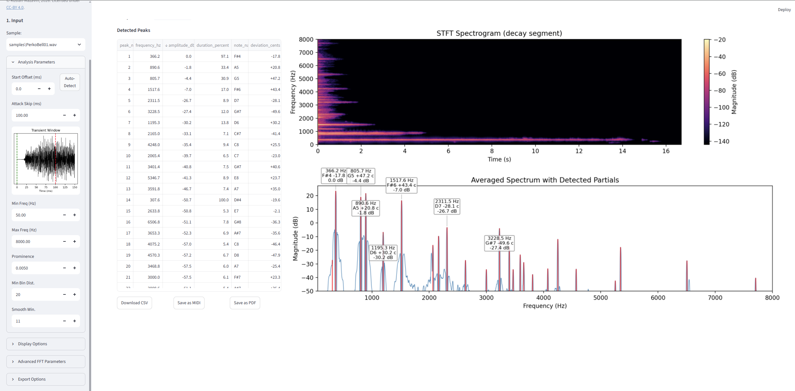

# Bell Sample Overtone Analyzer



A powerful tool with a beautiful **Streamlit Web UI** for analyzing bell WAV samples. It extracts spectral overtones, visualizes harmonic durations, and allows you to easily export the results to PDF and MIDI.

## Features

- **Interactive Web Interface**: Built with Streamlit for real-time visualization and parameter tweaking.
- **Smart Transient Detection**: Automatically finds the exact start of a bell strike using a fast RMS energy window.
- **Precision Audio Analysis**: Loads mono or stereo WAV files, skipping the initial noisy transient attack.
- **Peak Detection**: Detects spectral peaks with configurable prominence, distance, and smoothing.
- **Adaptive Visualizations**: Dynamic frequency scaling that automatically frames the lowest overtone, with a custom greedy collision-avoidance algorithm for peak labels ensuring clear readability on both linear and logarithmic scales.
- **12-TET Mapping**: Maps each peak to the nearest 12-TET note and reports cent deviation.
- **Export Options**: Export the analysis to CSV, MIDI (for synthesizers), and high-quality PDF reports with embedded rasterized spectrograms.
- **Real-time Waveform View**: See exactly what part of the transient you are trimming directly in the sidebar.

## Quick start

```bash
python -m venv venv
venv\Scripts\pip install -r requirements.txt

# Launch the Web GUI
python analyze_bell.py
```

Streamlit will automatically open the analyzer in your web browser.

## Export Features

- **PDF Export**: Generates a clean PDF containing the data table, the waveform spectrum, and a compressed rasterized spectrogram.
- **MIDI Export**: Converts the loudest detected overtones (configurable limit) into a MIDI file with overlapping note durations based on how long each frequency rings out.

## Documentation

- [`docs/usage.md`](docs/usage.md) — CLI flag reference and examples (for headless operation)
- [`docs/config.md`](docs/config.md) — Configuration file reference
- [`docs/development.md`](docs/development.md) — Theory of operation and contribution guidelines
- [`README.ru.md`](README.ru.md) — Русская версия (Russian Version)

## License

This project is provided as-is for analysis and research.
